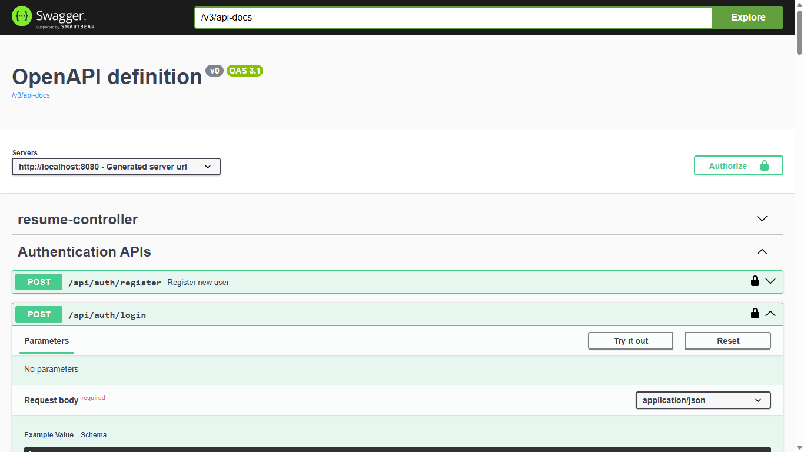
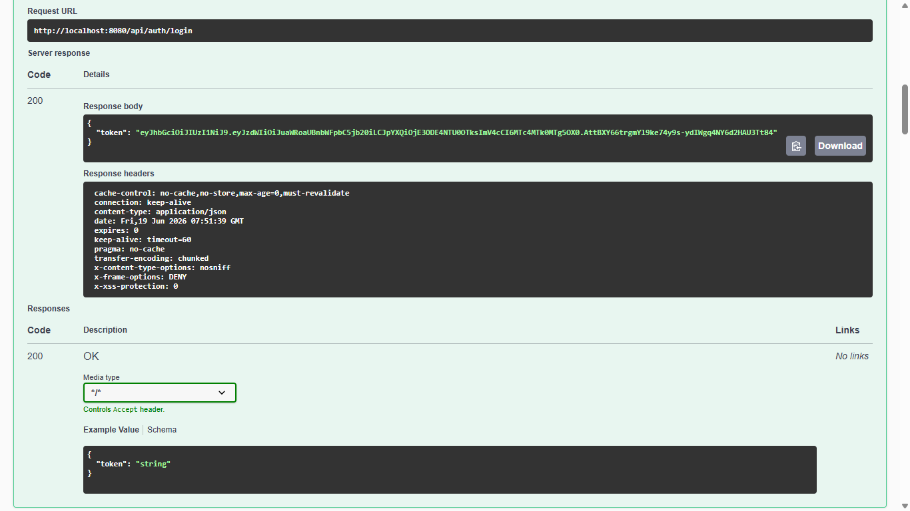
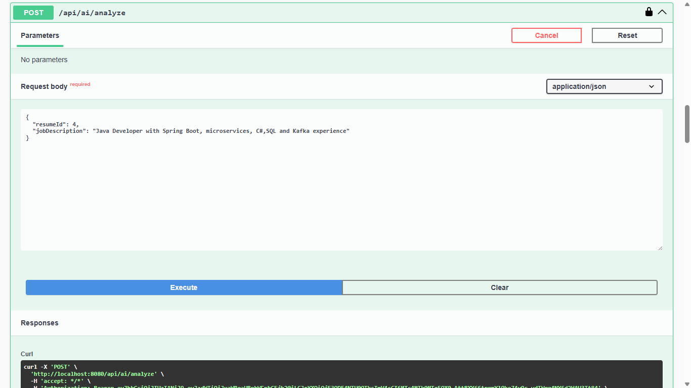
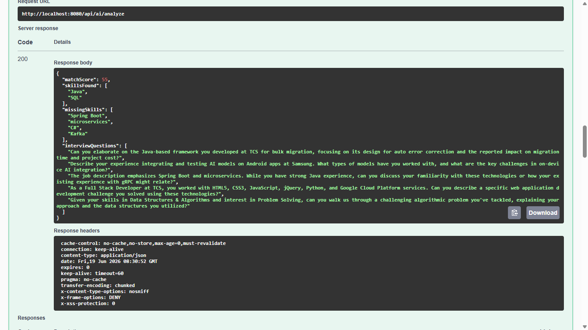
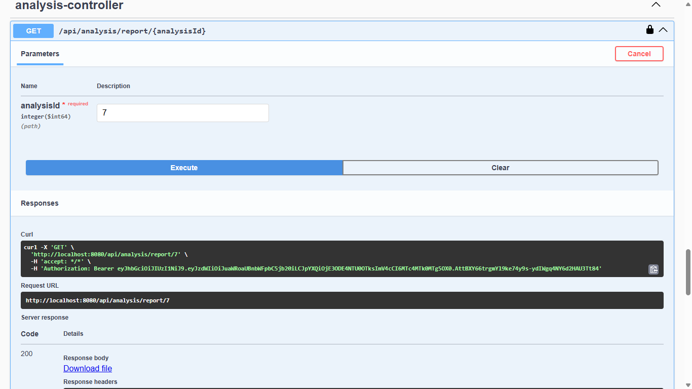
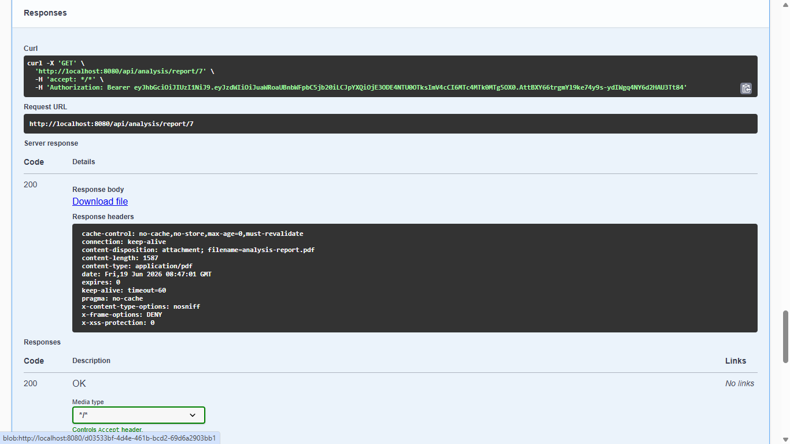

# 🚀 Resume AI Assistant

<p align="center">
  <b>AI-Powered Resume Analysis Platform built with Spring Boot, PostgreSQL, JWT Authentication, and Google Gemini AI</b>
</p>

<p align="center">
  Analyze resumes, identify skill gaps, calculate match scores, and generate AI-powered interview questions.
</p>

---

## 🌐 Live Demo

🔗 **Swagger API Documentation**

https://resume-ai-assistent.onrender.com/swagger-ui/index.html

---

## ✨ Key Features

✅ User Registration & Login

✅ JWT Authentication & Authorization

✅ Resume PDF Upload

✅ PDF Text Extraction using Apache PDFBox

✅ AI-Powered Resume Analysis with Gemini AI

✅ Resume Match Score Calculation

✅ Skills Found & Missing Skills Detection

✅ AI-Generated Interview Questions

✅ Analysis History Tracking

✅ PDF Report Generation

✅ Global Exception Handling

✅ Swagger API Documentation

✅ Dockerized Deployment

---

## 🛠️ Tech Stack

| Category       | Technologies               |
| -------------- | -------------------------- |
| Backend        | Java 21, Spring Boot 3     |
| Security       | Spring Security, JWT       |
| Database       | PostgreSQL                 |
| ORM            | Spring Data JPA, Hibernate |
| AI Integration | Google Gemini API          |
| Documentation  | Swagger / OpenAPI          |
| Deployment     | Docker, Render             |
| Build Tool     | Maven                      |

---

## 🏗️ System Workflow

```text
User Login/Register
        │
        ▼
 Upload Resume PDF
        │
        ▼
 Extract Text (PDFBox)
        │
        ▼
 Send Resume + Job Description
        │
        ▼
      Gemini AI
        │
        ▼
 Resume Analysis
 ├─ Match Score
 ├─ Skills Found
 ├─ Missing Skills
 └─ Interview Questions
        │
        ▼
 Store Results in PostgreSQL
        │
        ▼
 History & PDF Reports
```

## 📌 API Endpoints

### 🔐 Authentication

| Method | Endpoint             |
| ------ | -------------------- |
| POST   | `/api/auth/register` |
| POST   | `/api/auth/login`    |

### 📄 Resume Management

| Method | Endpoint             |
| ------ | -------------------- |
| POST   | `/api/resume/upload` |

### 🤖 AI Analysis

| Method | Endpoint                           |
| ------ | ---------------------------------- |
| POST   | `/api/analyze/analyze`             |
| GET    | `/api/analysis/history/{resumeId}` |

### 📊 Reports

| Method | Endpoint                            |
| ------ | ----------------------------------- |
| GET    | `/api/analysis/report/{analysisId}` |

---

## 🗄️ Database Entities

The application stores:

* 👤 Users
* 📄 Uploaded Resumes
* 📊 Analysis Results
* 🎯 Match Scores
* 💡 Skills Analysis
* 🎤 Interview Questions
* 📜 Analysis History

---

## 📷 Project Screenshots

### Swagger API Documentation

Add screenshots here:

 

 
 



---

## 🚀 Deployment

**Platform:** Render

**API Documentation:**

https://resume-ai-assistent.onrender.com/swagger-ui/index.html

---

## 🔮 Future Enhancements

* Refresh Token Authentication
* Role-Based Access Control (RBAC)
* React Frontend
* Unit & Integration Testing
* CI/CD Pipeline
* Email Notifications
* Resume Version Comparison
* Multi-Role Support

---

## 👩‍💻 Author

### Nidhi Rahangdale

**Java Backend Developer**

### Skills

Java • Spring Boot • Hibernate • PostgreSQL • REST APIs • JWT • Docker • Maven • Git

---

⭐ If you found this project helpful, consider giving it a star on GitHub.
