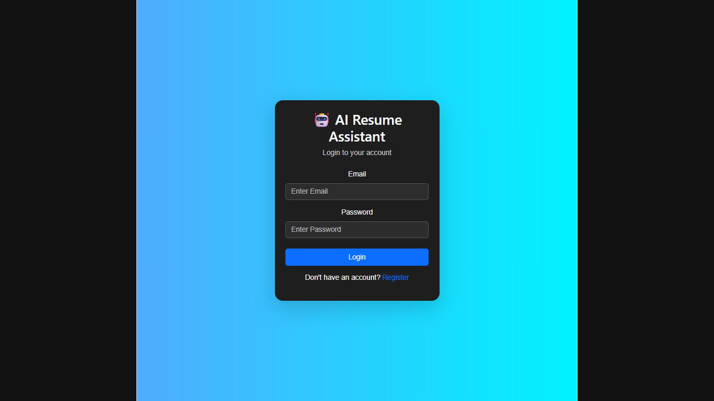
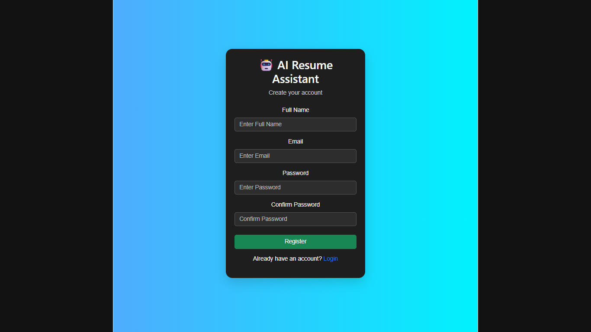
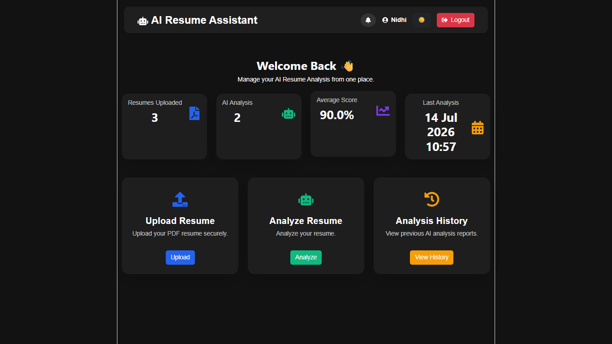
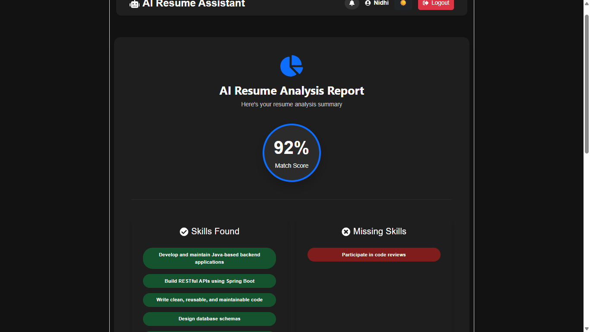

# 🤖 Resume AI Assistant

An AI-powered Resume Analysis Platform built with **Spring Boot, React, PostgreSQL, JWT Authentication, and Google Gemini AI**.

The application analyzes resumes against a Job Description, calculates a match score, identifies missing skills, and generates AI-powered interview questions to help candidates improve their resumes.

---

## 🌐 Live Demo

### 🚀 Frontend
https://resume-ai-assistent.vercel.app

### 📚 Backend API (Swagger)
https://resume-ai-assistent.onrender.com/swagger-ui/index.html

---

# ✨ Features

- ✅ User Registration & Login
- ✅ JWT Authentication & Authorization
- ✅ Secure Protected APIs
- ✅ Resume PDF Upload
- ✅ PDF Text Extraction using Apache PDFBox
- ✅ AI Resume Analysis using Google Gemini AI
- ✅ Resume Match Score Calculation
- ✅ Skills Found Detection
- ✅ Missing Skills Detection
- ✅ AI Generated Interview Questions
- ✅ Analysis History
- ✅ PDF Report Download
- ✅ Dashboard Statistics
- ✅ Dark Mode Support
- ✅ Toast Notifications
- ✅ Upload Loading Indicator
- ✅ Global Exception Handling
- ✅ Swagger API Documentation
- ✅ Dockerized Backend Deployment

---

# 🛠️ Tech Stack

| Category | Technologies |
|----------|--------------|
| Frontend | React.js, Vite, Bootstrap 5 |
| Backend | Java 21, Spring Boot 3 |
| Security | Spring Security, JWT |
| Database | PostgreSQL |
| ORM | Spring Data JPA, Hibernate |
| AI | Google Gemini API |
| PDF Processing | Apache PDFBox |
| Documentation | Swagger / OpenAPI |
| Deployment | Render, Vercel |
| Build Tool | Maven |

---

# 🏗️ System Architecture

```
                React Frontend (Vercel)
                        │
                        ▼
              Spring Boot REST APIs
                        │
                        ▼
           Spring Security + JWT Auth
                        │
                        ▼
                  PostgreSQL Database
                        │
                        ▼
              Google Gemini AI API
                        │
                        ▼
              Resume Analysis Result
```

---

# 🔄 Application Workflow

```
User Login/Register
        │
        ▼
 Upload Resume PDF
        │
        ▼
Extract Resume Text
 (Apache PDFBox)
        │
        ▼
Enter Job Description
        │
        ▼
 Google Gemini AI
        │
        ▼
 Resume Analysis
 ├── Match Score
 ├── Skills Found
 ├── Missing Skills
 └── Interview Questions
        │
        ▼
 Store Analysis
(PostgreSQL Database)
        │
        ▼
 History & PDF Reports
```

---

# 📌 REST API Endpoints

## 🔐 Authentication

| Method | Endpoint |
|--------|----------|
| POST | `/api/auth/register` |
| POST | `/api/auth/login` |

---

## 📄 Resume

| Method | Endpoint |
|--------|----------|
| POST | `/api/resume/upload` |

---

## 🤖 AI Analysis

| Method | Endpoint |
|--------|----------|
| POST | `/api/ai/analyze` |

---

## 📊 Analysis

| Method | Endpoint |
|--------|----------|
| GET | `/api/analysis/history/{resumeId}` |
| GET | `/api/analysis/report/{analysisId}` |

---

# 🗄️ Database

The application stores:

- 👤 Users
- 📄 Uploaded Resumes
- 📊 AI Analysis Results
- 🎯 Match Scores
- ✅ Skills Found
- ❌ Missing Skills
- 💬 Interview Questions
- 📜 Analysis History

---

# 📷 Screenshots

> Add screenshots inside a **screenshots/** folder.

Example:

```
# 📷 Screenshots

## 🔐 Login Page



---

## 📝 Register Page



---

## 🏠 Dashboard



---

## 📄 Resume Upload


---

## 🤖 Resume Analysis


---

## 📊 Analysis Result


```

---

# 🚀 Run Locally

### Clone Repository

```bash
git clone https://github.com/nidhiRahan/Resume-AI-Assistent.git
```

### Backend

```bash
cd backend
mvn clean install
mvn spring-boot:run
```

### Frontend

```bash
cd frontend
npm install
npm run dev
```

---

# 🚀 Deployment

### Frontend

- Vercel

### Backend

- Render

### Database

- PostgreSQL

---

# 🔮 Future Enhancements

- Refresh Token Authentication
- Role-Based Access Control (RBAC)
- Email Notifications
- Resume Version Comparison
- ATS Score Improvement Suggestions
- Unit Testing
- Integration Testing
- CI/CD Pipeline
- Admin Dashboard

---

# 👩‍💻 Author

**Nidhi Rahangdale**

Java Full Stack Developer

### Skills

- Java
- Spring Boot
- React.js
- Spring Security
- JWT
- Hibernate
- PostgreSQL
- Google Gemini AI
- REST APIs
- Maven
- Docker
- Git
- Render
- Vercel

---

⭐ If you found this project helpful, consider giving it a **Star** on GitHub.
